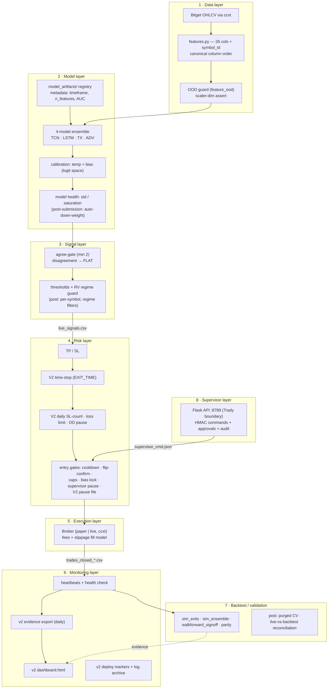

# AI Trading Bot — V2 Architecture

Status: design approved, incremental implementation in progress on branch `bot-v2-architecture`.
Date: 2026-06-12. Submission deadline: 2026-06-25.

---

## 1. Executive summary

V2 is **not a rewrite**. The V1 bot (4-model DL ensemble → signal writer → executor, paper
mode on AWS EC2) works, has survived a real bug history, and carries diagnostics that took
weeks to build. V2 is an **architecture target plus an incremental safety/observability
layer**: everything shipped before 25 June is additive, flag-gated, disabled by default,
and reversible with one `git revert`. The full modular V2 (feature contracts, model
registry, decomposed executor) is specified here and built **after** submission.

The architecture is organized as 8 layers. For each layer this document states what V1
**already has** (a lot), what is **new now** (pre-25 June), and what is **post-submission**.

### Design principles

1. **V1 untouched by default.** Exactly one V1 file is modified (`tools/live_executor.py`,
   6 small hook sites). With no `V2_*` env flags set, behavior is bit-identical to V1.
2. **Failure isolation.** V2 code may never crash V1: lazy import, every hook wrapped in
   `try/except`, and a `V2_RISK_DISABLED=1` master off-switch. If the `v2/` package is
   deleted from disk, the executor logs one warning and runs as pure V1.
3. **Everything reversible.** Flags off → V1 behavior. `git revert` of one commit → V1 code.
   `touch run/V2_PAUSE` → instant entry pause without restart; delete the file to resume.
4. **Contracts over coincidence.** The V1 root-cause incident (feature-set skew passing
   every dimension check) proves that *dimension-match is not feature-match*. V2's core
   post-submission idea: every artifact and IPC file carries an explicit, versioned,
   hash-checked schema.
5. **Evidence first.** Daily evidence bundles, a static dashboard, and deploy markers make
   the paper-trading record auditable for the submission report.

---

## 2. The 8 layers

### 2.1 Data layer

| | |
|---|---|
| **Already in V1** | Market ingestion via ccxt in the writer (`tools/live_writer.py`); 26 stationary price-action/volume features (`features.py FEATURE_COLS`) + optional `symbol_id` channel; explicit shared column order (`canonical_feature_columns()`); per-symbol feature windows (`ml_dl/dl_ensemble.refresh_live_features_per_symbol`); OOD guard (`dl_ensemble.feature_ood` + first-tick check, forces `allow=0` and logs FATAL on off-distribution inputs); startup scaler-dim assert (writer refuses to start on width mismatch). |
| **New now** | Nothing — the data path is the most battle-tested part of V1 and is frozen until after submission. |
| **Post-submission** | **Feature contract**: a versioned `FeatureSet` (id, ordered names, per-feature formula hash, timeframe, warm-up bars). The training pipeline stamps the contract hash into model metadata; the serving loader refuses to score when hashes differ. This converts the "26+symbol_id == 27 == new-27" coincidence class of bugs from *silent* to *impossible*. Also: candle-cache integrity checks and gap detection. |

### 2.2 Model layer

| | |
|---|---|
| **Already in V1** | `model_artifacts/` as an implicit registry (`dl_{kind}_latest.pt` + `*_metadata.json` with kind/seq_len/n_features/symbols/timeframe/label/val_auc/trained_at, `scaler_*_latest.joblib`); 4-model ensemble (TCN/LSTM/TX/ADV) with per-model temperature + bias calibration applied in logit space (`DL_TEMP_*`, `DL_BIAS_*`); `min_auc` gate (0.52) before an artifact becomes "latest"; walk-forward training (`ml_dl/dl_walkforward.py`); stable `symbol_id_map` persisted in metadata. |
| **New now** | Nothing in code. Model health is *observed* via existing `tools/diagnose_bias.py` / `tools/diagnose_features.py` and the new dashboard surfaces trade-level outcomes. |
| **Post-submission** | **Explicit model registry** (`v2/models/registry.py`): immutable versioned bundles `{weights, scaler, metadata{feature_contract_hash, timeframe, seq_len, label_spec, val_metrics}}`; loading validates contract hash AND timeframe against the live config — the train-5m/serve-1m mismatch becomes a refused start, not a silent collapse. **Model health metrics** as first-class signals: rolling per-model output std, saturation %, agreement entropy — a "dead" model (TCN std≈0.009 incident) is auto-down-weighted out of the agree-gate. **Shadow models**: next-candidate bundle scores in parallel, logged not traded, promoted only after N days of healthier metrics. **Calibration monitoring**: rolling reliability (predicted p vs realized hit-rate) per model per symbol. |

### 2.3 Signal layer

| | |
|---|---|
| **Already in V1** | Agree-gate (`DL_MIN_AGREE=2`) with **disagreement-as-FLAT** (fixed: disagreement used to emit a fake −0.5 SHORT; now emits neutral with `allow=0`); zero-weight models excluded from the gate vote; confidence threshold (`DL_P_LONG`, executor `--plong`/adaptive threshold); RV regime guard (`EXEC_RV_MAX`); side filter (`--sides`); `DL_ALLOW_ONLY` gating. |
| **New now** | Nothing — signal semantics are frozen so the current paper sample stays judgeable. |
| **Post-submission** | **Per-symbol thresholds** (ETH and SOL demonstrably need different operating points — see `tools/sim_ensemble.py` output); **regime filters** (trend/vol regime classifier gating which side may trade — the architectural answer to the oscillating 95–100 % one-sided signal regime); tier2 funding/OI influence graduating from shadow to paper after backtest sign-off. |

### 2.4 Risk layer

| | |
|---|---|
| **Already in V1** | TP/SL per position (`EXEC_TP_PCT`/`EXEC_SL_PCT`, trigger on mid, fill adversely slipped); cooldown (`EXEC_COOLDOWN_SEC`); flip-confirm ticks (`EXEC_FLIP_CONFIRM_TICKS`) against flip-churn; duplicate-fill guard; `one_position`/`max_symbols` concurrency caps; per-trade and portfolio notional caps (incl. scale-in path); side-bias lock (`EXEC_BIAS_GUARD`, ≥95 % one-sided → entries suspended, exits alive); supervisor pause/reduce-risk/conservative/emergency-stop; restart position recovery + restart-close past TP/SL. |
| **New now** | **`v2/risk_controls.py`** wired into the executor behind flags, all default-off: **time-stop** (`V2_TIME_STOP_MIN` — close any position held ≥ N minutes, exit reason `EXIT_TIME`; TP/SL keeps priority); **daily SL-count limit** (`V2_MAX_SL_PER_DAY` — after N stop-loss exits in a UTC day, block new entries until midnight); **daily loss limit** (`V2_DAILY_LOSS_LIMIT_USDT` — block entries when realized day PnL ≤ −X); **daily drawdown pause** (`V2_DAILY_DD_LIMIT_USDT` — block entries when day PnL falls ≥ X below its intraday peak); **pause-file kill switch** (`touch run/V2_PAUSE` blocks entries instantly, no restart; delete to resume). Counters rebuild from the append-only `trades_closed_YYYYMMDD.csv` at startup, so restarts/stale state cannot misfire them. |
| **Post-submission** | Account-level max-drawdown enforcement (run.json `MAX_DD=0.05` is currently *defined but unenforced*); volatility-aware position sizing; risk engine consolidation (`v2/risk/engine.py`) absorbing the V1 guards + V2 controls behind one policy interface. |

### 2.5 Execution layer

| | |
|---|---|
| **Already in V1** | One `Broker` class (paper + live via ccxt/Bitget); paper fill model with taker **fees both sides + adverse slippage** (`EXEC_FEE_BPS`, `EXEC_SLIPPAGE_BPS`) applied at all five fill sites; flash-close endpoint for Bitget flip error 22002; reduce-only close orders; atomic `executor_state.json` persistence each tick; single-instance lock; live-mode exchange reconciliation on restart. |
| **New now** | Nothing. Live trading stays **disabled**; paper mode untouched. |
| **Post-submission** | **Exchange adapter abstraction** (`v2/execution/broker_adapter.py`): a small interface (`market_order`, `close_position`, `fetch_positions`, `fetch_price`) so Bitget/ccxt is one adapter and a richer paper simulator another; partial-fill and latency modelling in the fill model; order-state machine with idempotent retries. |

### 2.6 Monitoring layer

| | |
|---|---|
| **Already in V1** | Writer + executor heartbeats (atomic JSON); `tools/bot_health_check.py` (8-section diagnostic: services, artifacts, env, heartbeats, state, signal quality, trade performance, recent errors); `diagnose_features.py` (OOD vs degenerate), `diagnose_bias.py`; daily-rotated CSV logs; side-bias alerts into heartbeat + err logs. |
| **New now** | **`tools/v2_evidence_export.py`** — per-UTC-day evidence bundle (trades, win rate, net PnL, profit factor, max intraday DD, exit-reason and per-symbol breakdowns) → `reports/evidence/YYYYMMDD/{summary.json,summary.md}` + rolling `index.json`. **`tools/v2_dashboard.py`** — self-contained static HTML (no server, no JS): status cards, daily PnL, cumulative PnL SVG, exit reasons, last trades, V2 risk state, deploy markers. **`tools/v2_log_archive.py`** — gzip dated logs older than N days into `logs/archive/YYYYMM/`; dry-run by default. **`tools/v2_deploy_marker.py`** — records ts/sha/branch/note to `logs/deploy_markers.csv` *and* `logs/DEPLOY_MARKERS.txt` (kept compatible with `sim_exits.py --since <sha>`). |
| **Post-submission** | Alerting (wire existing `telegram_bot.py` to heartbeat-age, OOD, bias-lock, and V2-block events); metric retention beyond CSV (SQLite); dashboard served by the supervisor API for Trady. |

### 2.7 Backtest / validation layer

| | |
|---|---|
| **Already in V1** | `tools/sim_exits.py` — **counterfactual exit simulator** (read-only TP/SL/time-stop grid replay over recorded trades, with session filters and cost-model reconciliation); `tools/sim_ensemble.py` — ensemble-variant side-bias replay (current/equal/no-TCN/ADV-off weights); `tools/walkforward_signoff.py` — walk-forward KPI sign-off (Sharpe/Sortino/DD/PF); `tools/parity_check.py` + `tools/test_fixes_123.py` — train/serve parity and offline regression validators; `ml_dl/dl_walkforward.py` rolling-window training. |
| **New now** | Nothing new needed — `sim_exits.py` already answers "what TP/SL/time-stop would have done", and its output justifies the chosen `V2_TIME_STOP_MIN` value when the user enables it. A pytest suite (`tests/`) is added for all new V2 code. |
| **Post-submission** | **Purged/embargoed walk-forward CV** (López de Prado-style) to stop overlapping-label leakage in model selection; **live-vs-backtest reconciliation** — replay each live day through the backtester with recorded signals and assert PnL/trade-count agreement within tolerance (any gap = serve-pipeline bug, the class of defect that caused the V1 collapse); promotion gates requiring reconciliation pass before any model/threshold change ships. |

### 2.8 Supervisor layer

| | |
|---|---|
| **Already in V1** | A full supervisor stack exists (`supervisor/`): Flask API (default port 8789) described in code as the *integration boundary for Trady*; HMAC-SHA256-signed commands (`SUPERVISOR_HMAC_SECRET`) — `pause`, `resume`, `reduce_risk`, `conservative_mode`, `emergency_stop` — delivered via atomic `logs/supervisor_cmd.json`, polled by the executor, ACKed via `supervisor_ack.json`; **two-step human approval** (create → confirm → consume, TTL 300 s/120 s, single-use) required for risky commands (`resume_live`, `switch_to_live`, `increase_leverage`, `flatten_all`, `disable_safety`, …); JWT auth + nonce/timestamp replay protection + per-actor rate limits; append-only audit trail `logs/supervisor_audit.jsonl`. |
| **New now** | Nothing in code. The runbook documents the supervisor as the second rung of the kill-switch ladder. |
| **Post-submission** | **Trady read-only first**: expose dashboard/evidence/health over the existing API before any write path; then graduate Trady to the signed pause/resume channel; risky-action approvals stay human-in-the-loop; audit log review tooling. |

---

## 3. Architecture diagram



Writer process = layers 1–3 (`tools/live_writer.py`). Executor process = layers 4–5
(`tools/live_executor.py`). IPC: `logs/live_signals.csv` (today; named-column schema
post-submission). Monitoring/validation tools are offline readers of `logs/`.

---

## 4. Target V2 file tree (post-submission)

Built now (pre-25 June) pieces are marked ✅; the rest is the post-submission target.

```
ai-trading-bot/
├─ docs/                          ✅ this design + runbook + safety + roadmap + report outline
├─ .env.v2.example                ✅ V2 flags, all off by default
├─ v2/
│  ├─ __init__.py                 ✅
│  ├─ risk_controls.py            ✅ time-stop, SL-count, loss/DD pause, pause file
│  ├─ contracts/
│  │  ├─ feature_contract.py         versioned FeatureSet + schema hash
│  │  └─ signal_schema.py            named-column signal records (replaces CSV order coupling)
│  ├─ data/
│  │  ├─ ingestion.py                candle fetch + cache + gap checks
│  │  ├─ feature_service.py          contract-pinned feature computation
│  │  └─ ood.py                      OOD scoring (promoted from dl_ensemble)
│  ├─ models/
│  │  ├─ registry.py                 versioned bundles, hash+timeframe validation
│  │  ├─ ensemble_manager.py         weights, agree-gate, health-aware voting
│  │  ├─ calibration.py              temp/bias + reliability monitoring
│  │  └─ health.py                   std / saturation / agreement metrics
│  ├─ signal/
│  │  ├─ gate.py                     agree-gate, disagreement-as-flat
│  │  ├─ thresholds.py               global + per-symbol operating points
│  │  └─ regime.py                   trend/vol regime filters
│  ├─ risk/
│  │  └─ engine.py                   consolidates V1 guards + risk_controls + max-DD + sizing
│  ├─ execution/
│  │  ├─ broker_adapter.py           exchange-agnostic interface (Bitget = one adapter)
│  │  └─ fill_model.py               fees, slippage, partial fills, latency
│  ├─ monitoring/
│  │  ├─ evidence.py                 (library form of v2_evidence_export)
│  │  └─ alerts.py                   telegram/webhook alerting
│  └─ backtest/
│     ├─ walkforward.py              purged/embargoed CV
│     └─ reconcile.py                live-vs-backtest day replay
├─ tools/
│  ├─ v2_evidence_export.py       ✅ daily evidence bundles
│  ├─ v2_dashboard.py             ✅ static HTML dashboard
│  ├─ v2_log_archive.py           ✅ gzip rotation, dry-run default
│  ├─ v2_deploy_marker.py         ✅ deploy markers (csv + txt)
│  └─ (all existing V1 tools unchanged)
├─ tests/                         ✅ pytest suite for all V2 code
└─ pytest.ini                     ✅ scopes collection to tests/
```

---

## 5. Migration plan (V1 → V2)

### Stays as-is (proven, do not touch)
- `tools/live_writer.py` — ensemble serving, OOD guard, heartbeats.
- `ml_dl/` — models, ensemble, walk-forward training.
- `features.py` — the deployed 26-feature stopgap set (frozen until the planned retrain).
- `supervisor/` — complete; V2 only documents it.
- `tier2/` — shadow-only collection; graduates via its own backtest gate.
- All `tools/diagnose_*`, `sim_*`, parity/health scripts.

### Becomes an adapter (post-submission)
- `Broker` class in `live_executor.py` → first implementation of `v2/execution/broker_adapter.py`.
- `features.py` → wrapped by `v2/contracts/feature_contract.py` (same numbers, now hash-pinned).
- `model_artifacts/` layout → read through `v2/models/registry.py` (same files, validated load).

### Rewritten after submission
- `tools/live_executor.py` main loop → decomposed into signal-intake / risk-policy /
  execution stages with unit tests; the 6 V2 hook sites are the seam line.
- `logs/live_signals.csv` positional contract → named-column versioned schema
  (`v2/contracts/signal_schema.py`); executor reads by name, writer stamps schema version.
- Config: one typed, layered config (`run.json` → `.env` → CLI) with an *effective-config
  snapshot + hash* logged at startup on both boxes — the answer to local/EC2 `.env` drift.

### How to run V2 in shadow mode (now)
1. Deploy branch with **no** `V2_*` flags set → executor logs `v2_risk: disabled`, behavior
   is V1-identical. Run ≥1 day; diff logs to confirm nothing changed.
2. Enable observability only (evidence export, dashboard, deploy markers are offline tools —
   they never touch the trading path at all).
3. Enable risk flags on **paper** (`V2_TIME_STOP_MIN`, then the daily limits), watch
   `SKIP reason=v2_*` / `EXIT_TIME` lines and `logs/v2_risk_state.json`.
4. Live mode remains disabled regardless; that decision is out of scope until after 25 June.

---

## 6. V1 pathology register → architectural answer

| # | V1 pathology (documented incident) | V2 answer |
|---|---|---|
| 1 | Train/serve feature-set skew passed all dim checks → OOD inputs → all models saturated LONG | Feature contract with schema hash pinned in artifact metadata; load-time refusal (post-sub). OOD guard already live (V1). |
| 2 | Config drift: local `.env` vs EC2 `.env` vs systemd CLI flags | Effective-config snapshot + hash at startup (post-sub); runbook checklists `systemctl cat` (now); `.env.v2.example` documents instead of duplicating (now). |
| 3 | CSV column-order coupling writer→executor ("first 8 columns in this exact order") | Named-column versioned signal schema (post-sub). |
| 4 | Flip-churn: 131/132 exits were FLIP_CLOSE, fee bleed | Flip-confirm ticks (V1, shipped); time-stop caps holding time (new now); regime filters attack the oscillating-signal cause (post-sub). |
| 5 | Agree-gate disagreement emitted fake −0.5 SHORT | Fixed in V1 (`fd8128b`): disagreement → neutral FLAT, zero-weight models lose their vote. Kept as a permanent signal-layer invariant. |
| 6 | Dead model (TCN std ≈ 0.009) acted as fake tiebreaker in the gate | Model-health metrics + health-aware voting (post-sub); meanwhile weights configurable via `DL_MODEL_WEIGHTS`. |
| 7 | No time-stop / daily-loss / drawdown enforcement (`MAX_HOLD_BARS`, `MAX_DD` defined but unenforced) | **Shipped now**: `v2/risk_controls.py` time-stop + daily SL-count + loss limit + DD pause + pause file, all flag-gated. Account-level max-DD post-sub. |
| 8 | Paper PnL ignored fees/slippage → fake positive PF | Fixed in V1 (`1870ecb`): fees+slippage at all five fill sites. V2 fill model extends this (post-sub). |

---

## 7. Risk register

| # | Risk | L×I | Mitigation |
|---|---|---|---|
| 1 | V2 bug crashes the V1 trading loop | L×H | Lazy import in `main()`, every hook try/except, defensive methods inside `v2/`, `V2_RISK_DISABLED=1` master switch, executor LOOP_ERROR backstop |
| 2 | Time-stop exit corrupts loop bookkeeping (flip counters, cooldown, dup guard) | M×M | Exit block clones the TP/SL cleanup exactly (pop position, active_symbols, `_flip_pending`, set `last_fill_time`/`last_fill_price`); observed on paper before judging |
| 3 | Stale/corrupt V2 state after restart misfires controls | M×M | Counters rebuilt from append-only `trades_closed_YYYYMMDD.csv` at init; entry-times pruned/first-seen synced; corrupt state → empty state, never raises |
| 4 | Entry-block gate misses an open path (scale-in/flip-open) | L×H | Single gate placed at the supervisor-pause position, upstream of all four open paths |
| 5 | Executor edit breaks offline validators or systemd start | L×H | Only one inert module-level line added; `tools/test_fixes_123.py` + `sanity_test.py` must pass before the wiring commit; first deploy runs with flags off |
| 6 | Config drift re-bites (.env vs systemd) | M×M | Example file is documentation-only; runbook requires `systemctl cat bot-executor` check; deploy markers record sha+note at every change |
| 7 | Log archive destroys evidence or sim inputs | L×H | Dry-run default, 14-day cutoff, gzip-verify-then-delete, runbook orders evidence export *before* archive, gunzip restores |
| 8 | UTC day-rollover edge cases (open position across midnight) | L×M | Rollover resets counters but preserves entry times; fake-clock unit tests cover it |
| 9 | Doc/scope overrun threatens the 25 June deadline | M×M | Docs front-loaded (first commit); cut order if slipping: log-archive tool → dashboard extras |
| 10 | Live-mode order failure inside time-stop block | L×M | Same semantics as V1 TP/SL failure (LOOP_ERROR, retry next signal); live mode is disabled until after submission anyway |

---

## 8. Before 25 June vs after 25 June

### Ships before 25 June (this branch)
| Item | Type |
|---|---|
| 5 docs (`docs/`) incl. this design, runbook, safety inventory, roadmap, report outline | docs |
| `.env.v2.example` — V2 flags documented, all off | config |
| `v2/risk_controls.py` + 6 flag-gated executor hooks (time-stop, SL-count, loss limit, DD pause, pause file) | code |
| `tools/v2_evidence_export.py`, `v2_dashboard.py`, `v2_log_archive.py`, `v2_deploy_marker.py` | tools |
| `tests/` pytest suite + `pytest.ini`; existing validators kept green | tests |
| Shadow-mode deploy procedure + rollback ladder | ops |

### Waits until after 25 June
- Feature contract / schema-hash pinning and the pending 27-feature retrain.
- Model registry, calibration monitoring, shadow-model promotion, health-aware ensemble voting.
- Per-symbol thresholds, regime filters, tier2 influence graduation.
- Account-level max-drawdown enforcement, volatility-aware sizing, risk-engine consolidation.
- Broker adapter abstraction, partial-fill model; **any** live-trading enablement.
- Purged/embargoed CV, live-vs-backtest reconciliation harness.
- Named-column signal schema; executor loop decomposition; typed layered config with snapshot hash.
- Telegram alerting wiring; Trady read-only dashboard, then signed write path.
- New symbols, threshold retuning, model retraining (would reset the paper evidence sample).
